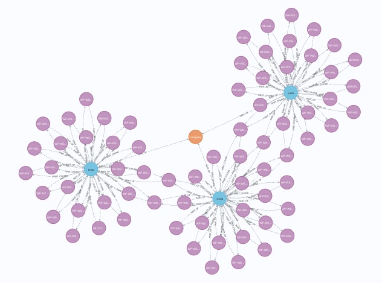
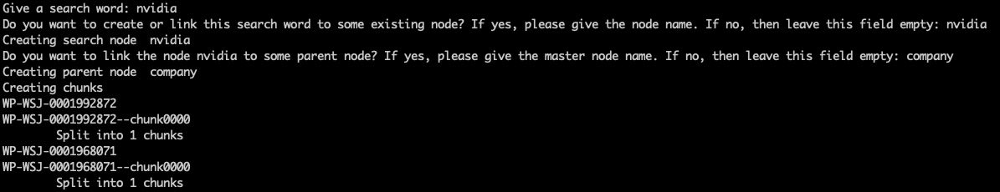
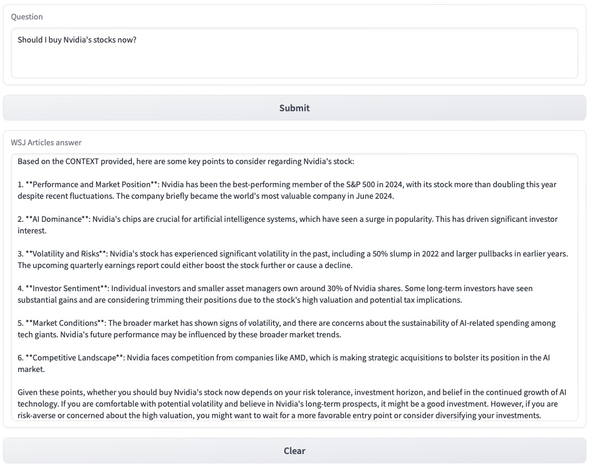
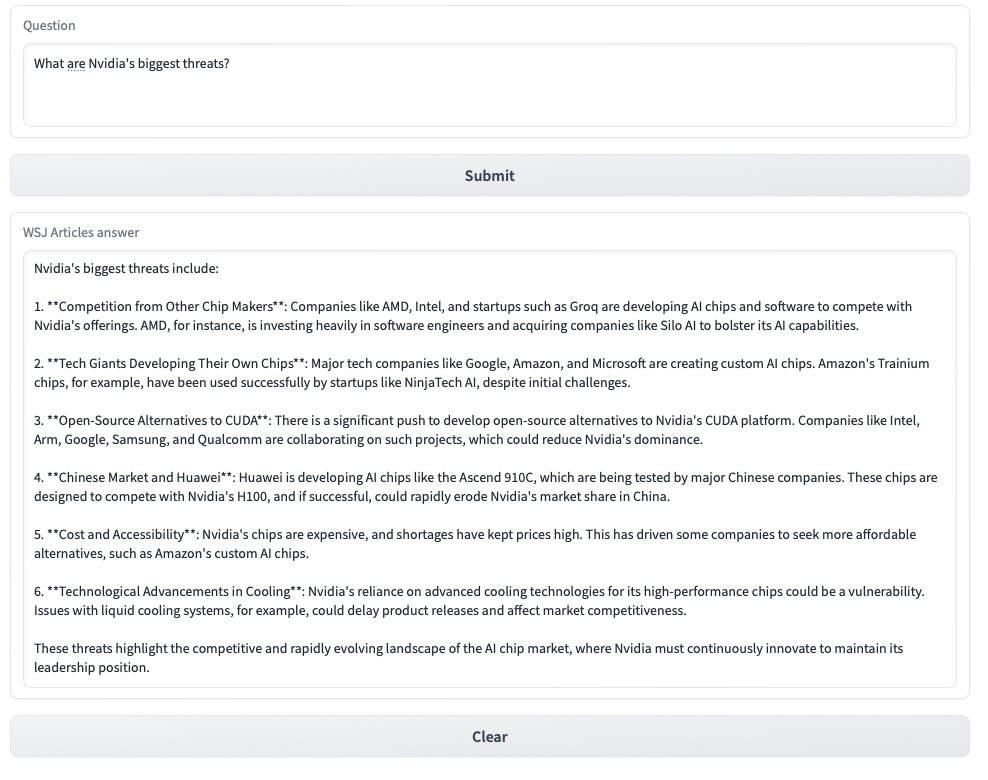

# Chat with WSJ articles

This repository provides instructions how to chat with the Wall Street Journal articles. We use Neo4j graph RAG, which is very efficient to give good and accurate results. The articles are divided into chunks and each chunk has its own metadata. This enables accurate queries and the necessary metadata parameters can be selected for the query.



## Setting up the Neo4j Desktop

We use the Neo4j Desktop. It is easy to install and monitor the database content. 

1. Download the software
2. When the installation is complete, create a Project
3. Inside a project, create a Graph DBMS
4. Open Terminal (in Desktop) and copy file 
```console
cp labs/apoc-5.22.0-core.jar plugins/
```
5. Edit the file conf/neo4j.conf and change the line
```console
dbms.security.procedures.unrestricted=jwt.security.*
```
to 
```console
dbms.security.procedures.unrestricted=jwt.security.*, apoc.*
```
6. Restart the database

The database should now be running and be empty.

## WSJ Rapid API

WSJ has APIs that works through the RAPID API. Log in to the service and subscribe to the WSJ. There are two APIs in use.

List of articles based on search term:

```python
import requests

url = "https://wall-street-journal.p.rapidapi.com/api/v1/searchArticleByKeyword"

querystring = {"keyword":"nvidia"}

headers = {
	"x-rapidapi-key": "your_own_API_KEY",
	"x-rapidapi-host": "wall-street-journal.p.rapidapi.com"
}

response = requests.get(url, headers=headers, params=querystring)

print(response.json())
```
and when the article IDs are known, the article details is retrieved using another API

```python
import requests

url = "https://wall-street-journal.p.rapidapi.com/api/v1/getArticleDetails"

querystring = {"articleId":"WP-WSJ-0001992872"}

headers = {
	"x-rapidapi-key": "your_own_API_KEY",
	"x-rapidapi-host": "wall-street-journal.p.rapidapi.com"
}

response = requests.get(url, headers=headers, params=querystring)

print(response.json())
```

## Create a graph database

We first setup up the virtual environment where we run the Python scripts

```console
python -m venv venv
source venv/bin/activate
pip install -r requirements.txt
```

We populate the database using some articles from the WSJ. We use three keywords: "nvidia", "meta" and "tesla" and take all the articles returned in the query. We use a simple script that first asks for a search term (script create_wsj_graph_db.py) . It automatically retrieves all WSJ documents that contain the keyword. It also creates some relationships between chunks and nodes. Below is an example of a "nvidia" search



and


## Chat with the articles

Now we are ready to chat with articles. We create a simple Gradio application that acts as an interface. The script is in file ask_wsj_articles.py. Below are some examples



and




